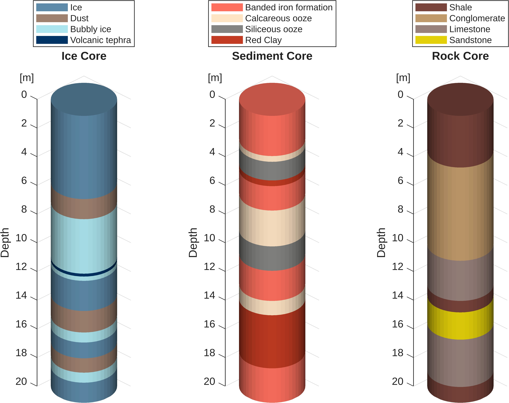
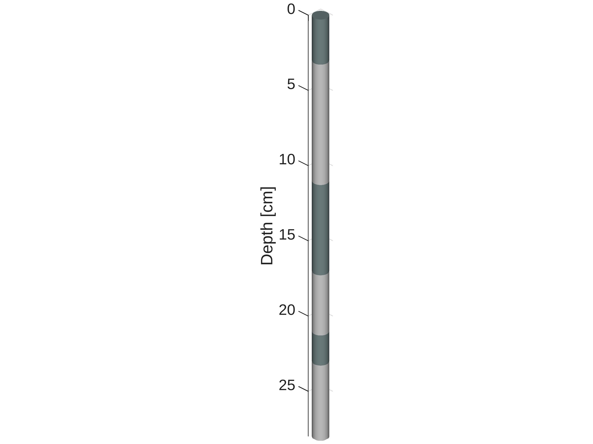
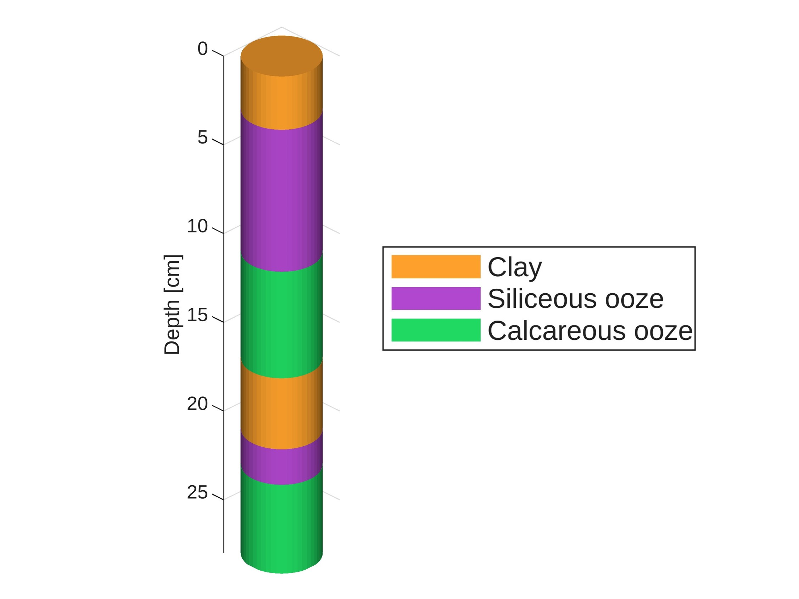
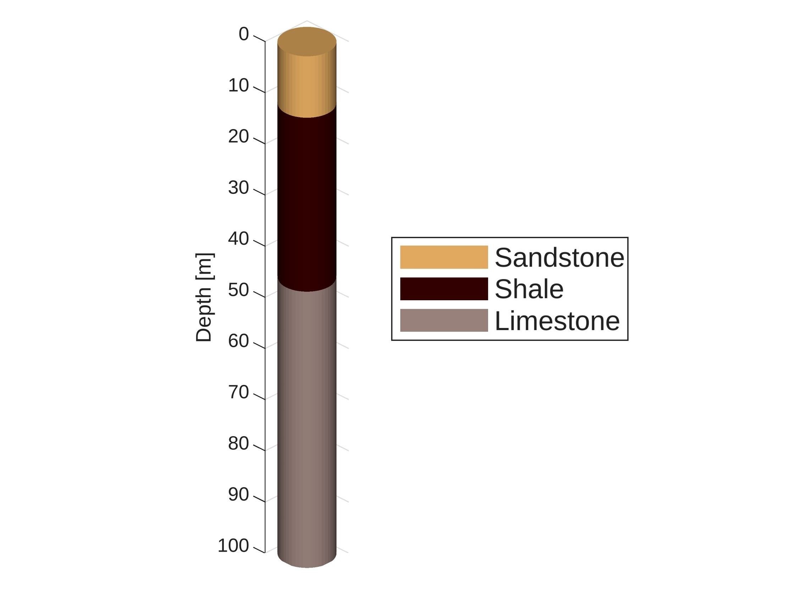
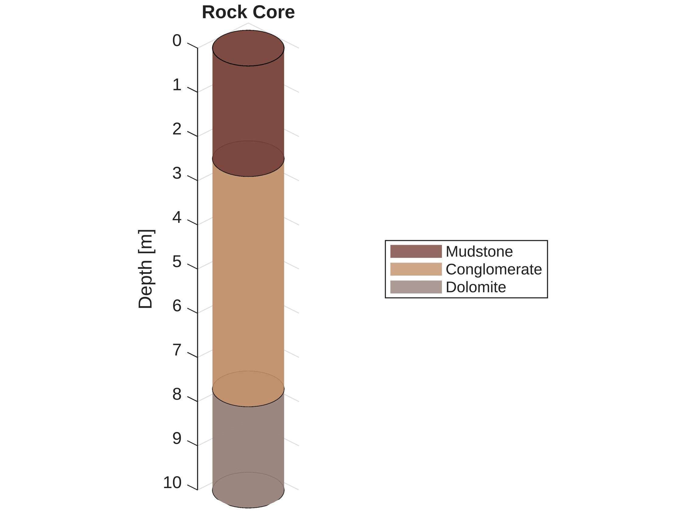
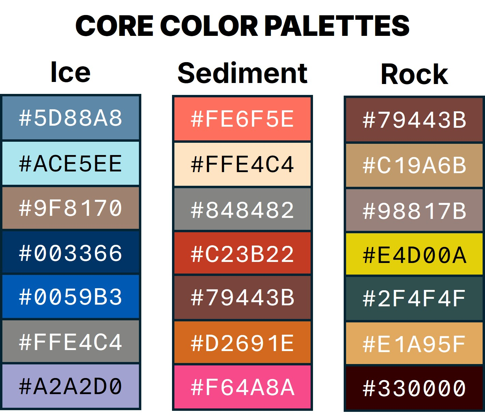

# <b> Core Stratigraphy Visualization </b>

[](https://www.mathworks.com/matlabcentral/fileexchange/173320) [](https://matlab.mathworks.com/open/fileexchange/v1?id=173320&file=demo.mlx)

MATLAB functions to generate a cylindrical representation of a rock core, sediment core, or ice core.



## <b> Table of Contents </b>
<b>

- [How to cite](#how-to-cite)
- [Documentation](#documentation) </b>
  - [core_plot()](#core_plot) - Core stratigraphy plotting function
  - [core_colors()](#core_colors) - Useful color palettes for core visualizations 
  <b>
- [License](#license)
- [Acknowledgements](#acknowledgements)

</b>

## <b> How to cite </b>

<b>APA</b>

[comment]: <> (According https://owl.purdue.edu/owl/research_and_citation/apa_style/apa_formatting_and_style_guide/reference_list_electronic_sources.html)

Weber, A. M. (2024). <em>Core stratigraphy visualization</em> (Version #.#.#). GitHub. https://github.com/weber1158/core-plot

<b>BibLaTeX</b>
<small>
```tex
@software{coreplot2024,
    author = {{Austin M. Weber}},
    title = {{Core Stratigraphy Visualization}},
    url = {https://github.com/weber1158/core-plot},
    version = {#.#.#}
    date = {YYYY-MM-DD}
}
```
</small>

## <b> Documentation </b>

### core_plot

Core stratigraphy visualization

<big>**Syntax**</big>

<small>

`core_plot(Z)`

`core_plot(Z,Name="Value")`

`plt = core_plot(Z)`

`[plt,patches] = core_plot(Z)`

</small>

<big>**Input Arguments**</big>

<small>

`Z` - </small> Numeric vector specifying the thickness of each layer in the core from top to bottom. <small>

`varargin` - </small> Optional name-value pairs.


<big>**Output Arguemnts**</big>

<small>

`plt` - </small> Returns handles to the graphics <small>

`patches` - </small> Individual layer objects as a <small>`N-by-1 Patch`</small> where <small>`N`</small> represents the number of layers in the stratigraphic visualization. Access/modify the properties of a specific patch with indexing. (e.g., <small>`patches(2).FaceColor='#FE68B2'`</small>)


<big>**Name-Value Pairs (Optional)**</big>

<small>

Name | Value | Description
:-- | :-- | :--
`Colors` | Cell vector or RGB matrix | Vector of hexadecimal codes or a matrix of RGB color codes. If the number of colors is less than the number of layers then the colors will repeat. If no colors are specified then the layers will be visualized using alternating shades of light and dark gray.
`LayerNames` | Cell or categorical vector | List of descriptor names for each layer that will be populated in the legend. The number of elements must match the number of layers.
`Radius` | Numeric scalar | A number greater than 0 that specifies the radius of the cylindrical objects (default=`0.5`)
`EdgeLines` | Logical | Specifies whether the edge lines of each layer should be displayed (default=`false`)
`Light` | Logical | Toggles the lighting object (default=`true`)
`FaceAlpha` | Numeric scalar | Specifies the face alpha property for all layers (default=`1`)
`EdgeAlpha` | Numeric scalar | Specifies the edge alpha property for all layers (default=`1`)
`EdgeWidth` | Numeric scalar | Specifies the width of the edge line property for all layers (default=`0.5`)
`ViewAngle` | Char | Character vector specifying the viewing angle. Either `oblique` (default) or `right`
`ZDataType` | Char | Character vector specifying the type of `Z` data. By default, `ZDataType` is set to `'thickness'` meaning that each value in `Z` represents the thickness of a stratigraphic layer. The other option for `ZDataType` is `'depth'` which clarifies that the values in `Z` represent the depths bounding each layer. This means that the number of elements in `Z` must be equal to the number of layers +1 because each layer shares a top boundary with another layer's bottom boundary, except for the first layer which has a top boundary that it does not share. For example, if there are four values in `Z`, such as `Z=[0 2 4 6]`, then the corresponding stratigraphic visualization when `ZDataType='depth'` will contain only three layers.

</small>


<big>**Examples**</big>

Visualize a sediment core.

<small>

```matlab
layer_thicknesses = [3 8 6 4 2 5];
core_plot(layer_thicknesses);
zlabel('Depth [cm]')
```


</small>

---

Specify the layer colors and the radius (width) of the core.

<small>

```matlab
layer_thicknesses = [3 8 6 4 2 5];
C = {'#FEA12C','#B147C3','#20D962'}; % hexadecimal colors
r = 2;
core_plot(layer_thicknesses, Colors=C, Radius=r);
zlabel('Depth [cm]')
legend('Clay','Siliceous ooze','Calcareous ooze')
```



</small>

---

Visualize a rock core using layer boundary data instead of layer thicknesses, and specify RGB colors instead of hexadecimals.

<small>

```matlab
layer_depths = [0 12 46 100];
C = [225 169 95; 51 0 0; 152 129 123]; % RGB triplets
core_plot(layer_depths, Colors=C, Radius=5, ZDataType='depth');
zlabel('Depth [m]')
legend('Sandstone','Shale','Limestone')
```


</small>


<big>**Notes**</big>

<small>

`core_plot` </small> uses functions from the Partial Differential Equations Toolbox in order to make the visualization. Users without the PDE Toolbox can still use <small>`core_plot`</small> in MATLAB Online, or, if the PDE Toolbox is not detected, the function will prompt the user if they would like to continue with a more basic core plotting visualization. 

The <small>`Colors`</small> name-value pair has been written to accept colored lists specified as either a cell vector of hexadecimal codes or an <small>`N-by-3`</small> matrix of RGB triplets. RGB triplets are automatically divided by 255 if they are not already in the normalize range (0,1).

</small>

---

### core_colors

Core color palettes

<big>**Syntax**</big>

<small>

`core_colors()`

`core_colors(palette)`

`core_colors(palette,n)`

`colorPalette = core_colors(...)`

</small>

<big>**Input Arguments**</big>

<small>

`[no input]` - </small> If no inputs are specified, a dialogue box will open showing the three possible color palettes. <small>

`palette` - </small> A string specifying the name of the color palette || `'ice'` OR `'sediment'` OR `'rock'` <small>

`n` - </small> Integer between 1 and 7 specifying the number of colors to extract from the palette.


<big>**Output Arguemnts**</big>

<small>

`colorPalette` - </small> Cell vector of hexadecimal color codes.

<big>**Examples**</big>

Get list of four hexadecimal codes from the <small>`'ice'`</small> color palette.

<small>

```matlab
core_colors('ice',4)

    1x4 cell array
        {'#5D88A8'} {'#ACE5EE'} {'#9F8170'} {'#003366'}
```

---

</small>

Make a 3-layer core plot using the <small>`'rock'`</small> color palette.

<small>

```matlab
Z = [0.000 2.500 7.710 10.000];
rock = core_colors('rock',3);
figure
core_plot(Z,Colors=rock,ZDataType='depth',Radius=0.7,...
    EdgeLines=true,FaceAlpha=0.8,Light=false)
zlabel('Depth [m]')
title('Rock Core')
legend('Mudstone','Conglomerate','Dolomite',...
    'Location','east')
```



---

</small>

View all of the color palettes.

<small>

```matlab
core_colors() % no input arguments or output arguments
```

</small>



## <b> License </b>
This project is licensed under the MIT License.

## <b> Acknowledgements </b>
The <small>`core_plot`</small> function uses code from Ayad Al-Rumaithi (2024) to generate the cylindrical objects in the visualization if the Paritial Differential Equations Toolbox is not found on the user's current path. I also thank MATLAB user Voss for clarifying the procedure needed to properly edit the patch objects in the non-PDE Toolbox visualization.


<b>Reference</b>

* Ayad Al-Rumaithi (2024). Generate Cylinder Mesh [V1.0.3]. MATLAB Central File Exchange. https://www.mathworks.com/matlabcentral/fileexchange/92288